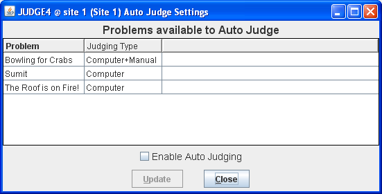
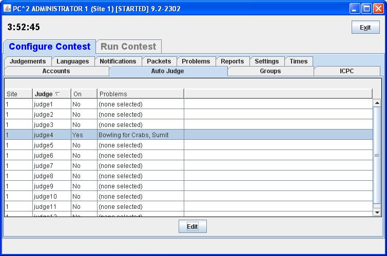

# Configurando cuentas para Juez Automático

En una competencia las preguntas pueden ser calificadas de forma manual o automática.
Esto se configura por pregunta.
Por defecto, cada pregunta se califica manualmente.
Esto quiere decir que es necesario ingresar al sistema e indicar que se usará un juez automático por cada pregunta que se desea calificar automáticamente.

## Asignando un usuario al juez automático

El Juez Automático es un programa que califica las respuestas de los competidores.
Este programa debe ejecutarse usando un usuario de tipo juez especialmente destinado para ello.
Es necesario configurar cuál usuario va a ser usado.

Para configurar un usuario para el juez automático, es necesario hacer los siguientes pasos en la herramienta ```pc2admin```:
 
 - Seleccione la pestaña **Configure Contest**
 - Seleccione la pestaña **Auto Judge**
 
 En este punto, debe aparecer en pantalla un listado de usuarios de tipo juez como la que se muestra a continuación:
 
  
 
 Note que en este listado todos los usuarios aparecen, en la columna **On** con el valor de **No**.
 Esto significa que ningún usuario ha sido configurado para ser juez automático.
 
 Para configurar un usuario para juez automático, seleccione el usuario de la lista y haga clic en **Edit**.
 Allí debe aparecer una pantalla como la que se muestra a continuación:
 
 
 
 En esa ventana aparecen todos los problemas y una caja de chequeo.
 Allí se deben selecionar todos los problemas que se quieren calificar automáticamente:
 
 - Seleccione los problemas que se quieren calificar automáticamente.
 - Haga clic en **Update** y defina el tipo de juez
 - Habilite la caja de chequeo que aparece **Enable Auto Judging**
 
 Una vez se ha configurado la cuenta para el juez automático, debe aparecer una pantalla como la que se muestra a continuación:
 
  
 
 Note que ya aparece uno de los usuarios en la columna **On** con un valor de **Yes**.
 
 