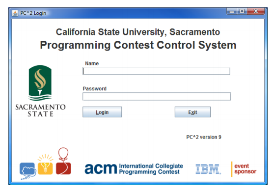
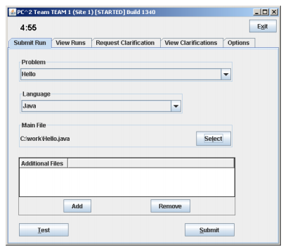
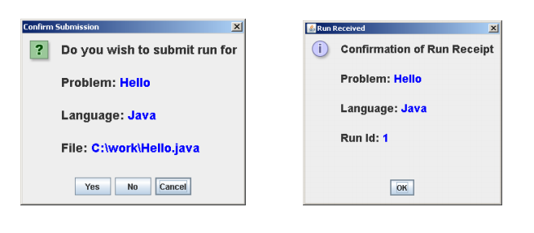
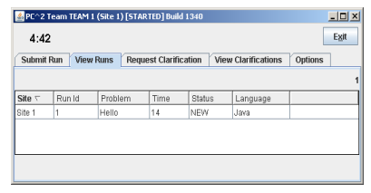
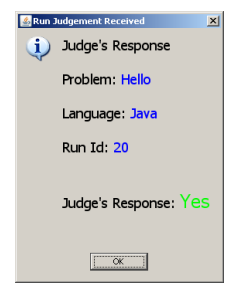
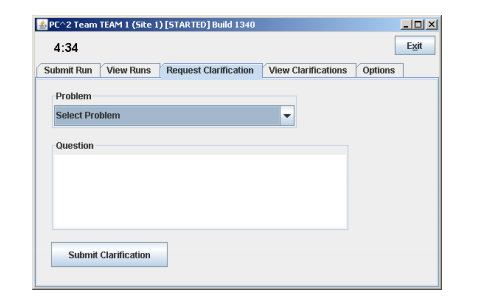
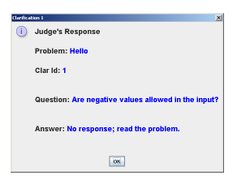
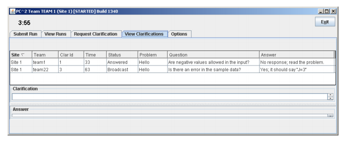

# Durante la Competencia

## Ingresando a la Competencia

Al iniciar el programa se te mostrará una pantalla de **Inicio de Sesión** como la que se muestra a continuación:

Para ingresar a la competencia es necesario ingresar la información del usuario que se le asignó personalmente.
Cada grupo participante tiene su propio nombre y contraseña.
El nombre de cada participante tiene la forma *equipoXX* (por ejemplo, "equipo1" o "equipo2").
Después de ingresar el nombre y la contraseña, es necesario hacer clic en el botón de **Login**.

## Presentando un programa a los jueces

Al ingresar al sistema, aparece la **Pantalla de la  Competencia** como la que aparece a continuación.
Note que la barra de título de la ventana aparece el nombre del equipo y del sitio de la competencia.
En la parte superior izquierda se muestra la cantidad de tiempo restante antes de terminar la competencia.

La pantalla tiene varias pestañas.
Al seleccionar la pestaña **Submit Run** es posible enviar la solución de algún problema a los jueces de la competencia.
Cada solución enviada se conoce como una corrida o *"run"*)

Para enviar una solución debes:
1. Seleccionar el problema en la lista desplegable **Problem**. En el ejemplo, se seleccionó el problema "Hello".
1. Seleccionar el lenguaje en la lista desplegable **Language**.
  En algunas competencias, solo se permitirán soluciones en un solo lenguaje (p.ej. solo se permitirán en Java).
1. Seleccionar el archivo principal a enviar como solución haciendo clic en el botón **Select**.
  En el ejemplo, el archivo seleccionado es "C:\work\Hello.java".
1. Opcionalmente, Enviar otros archivos de código fuente haciendo clic en el botón **Add**.
  No se deben enviar archivos con datos ni archivos ejecutables.
1. Opcionalmente, Hacer clic en el botón **Test** para hacer algunas pruebas sobre la solución.
1. Enviar la solución haciendo clic en el botón **Submit**

Al enviar la solución, aparecen cajas de diálogo confirmando de la solución como las que aparecen a continuación.
En la primera ventana se indican los archivos que se van a presentar y es posible confirmar o cancelar el envio.
Cuando la solución es recibida por los jueces, aparece la ventana de **Run Received** indicando el número de la solución.

## Revisando las soluciones enviadas

Es posible revisar los resultados de las soluciones enviadas.
En la ventana de la competencia, es posible seleccionar la pestaña **View Runs** para ver una tabla de resultados como la que aparece a continuación.

Cuando una solución es presentada por primera vez, el *Status* aparecerá como *NEW*, tal como se muestra en el ejemplo.

Si la calificación de las soluciones es manual, Cuando un juez termine de calificar tu programa, un mensaje **Judge’s Response** (respuesta del juez) como la que se muestra a continuación, aparecerá en pantalla.
El mensaje de la respuesta incluye información sobre si el programa es correcto o no.
Luego que se califique la solución, el campo de *Status* cambiará, pasando de *NEW* al valor de la respuesta del juez.

## Solicitando Aclaraciones

Si piensas que alguno de los problemas no es claro o tiene ambiguedades, puedes presentar una *solicitud de aclaración* a los jueces.
Para presentar una solicitud de aclaración, es necesario seleccionar la pestaña **Request Clarification**, tal como se muestra a continuación:

Para enviar una solicitud de aclaración, se debe:

1. Seleccionar el problema usando la lista desplegable **Problem**.
1. Escribir la pregunta en la caja de texto **Question**
1. y Hacer clic en el botón **Submit Clarification**

Normalmente los jueces solo envían respuestas intentando aclarar las especificaciones del problema.
Si los jueces consideran que el problema es suficientemente claro o la pregunta no corresponde, es posible que respondan indicando "No hay respuesta, lee el enunciado del problema".
La respuesta aparece en una ventana similar a la que aparece a continuación:

## Revisando las Aclaraciones

En cualquier momento es posible ver las respuestas enviadas por los jueces a las solicitudes de aclaración.
Para ver las respuestas se debe seleccionar la pestaña **View Clarifications**.
Deberá aparecer una pantalla como la que se muestra a continuación:

## Terminando la Participación en la Competencia

Para terminar la participación en la competencia, basta con presionar el botón de **Exit** en la parte superior derecha de la pantalla.

Aunque se cierre el programa, la información de las soluciones presentadas y las solicitudes de aclaración permanecen en un servidor de competencias.
Los profesores y jueces tendrán acceso a esa información incluso cuando cierres la aplicación.
Igualmente, Si no se ha iniciado una nueva competencia, esa información podrá verse en pantalla la próxima vez que ingreses al sistema.
